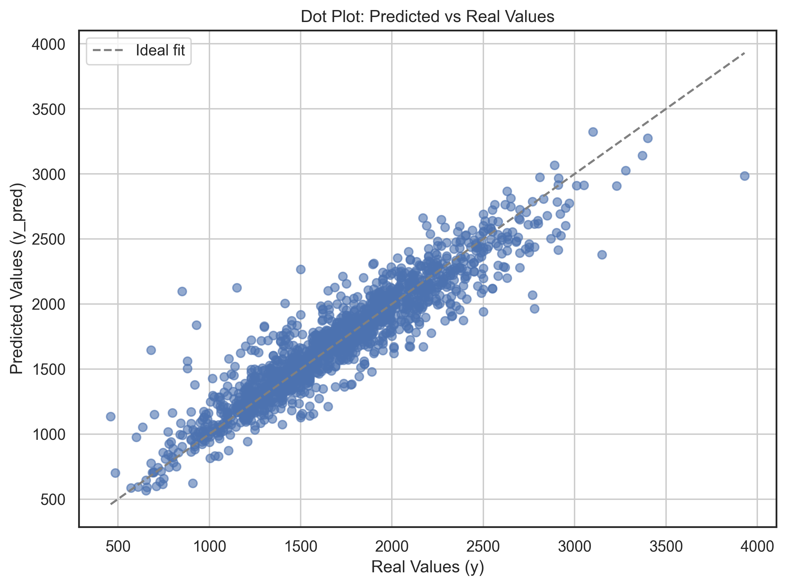

# apartment-rent-price-prediction-around-Bulach

A Streamlit app to predict real estate apartment rent prices from and around Bülach (CH).

You can use the app via the Streamlit link:

[Streamlit App Link](https://apartment-rent-price-prediction-arount-bulach-ereqtgclelgmmyjk.streamlit.app/)  <!-- Add your Streamlit app URL here -->

Feel free to play around, share, give feedback, and use!

## Table of Contents
1. [Project Description](#project-description)
2. [Usage](#usage)
3. [License](#license)
4. [Troubleshooting](#troubleshooting)
5. [Acknowledgments](#acknowledgments)

## Project Description

This project uses machine learning to predict apartment rental prices in Bülach (Switzerland) based on various features such as size, number of rooms, amenities, and more. The model retrieves data via an API and provides users with an estimated rent price, confidence interval, and a graphical representation of the prediction.

The alpha=0.5 Model was trained with LGBMRegressor on base of optuna parameters. The metrics are the follows:
Amount of train-val datapoints: 14'560
Amount of Out-Of-Sample datapoints: 1617
MAE Out-Of-Sample: 116.1708
RMSE Out-Of-Sample: 167.9133
R2 Out-Of-Sample: 0.868



For more information please contact me at https://www.immolex.ch

## Usage
### for use with steamlit
    Access the App on Steamlit: https://apartment-rent-price-prediction-arount-bulach-ereqtgclelgmmyjk.streamlit.app/

### for local use
#### Requirements

- Python 3.x
- Streamlit
- Dependencies listed in the `requirements.txt` file.

#### Clone the repository:
   ```bash
   git clone https://github.com/wonich/apartment-rent-price-prediction.git

    Navigate to the project directory:

    cd apartment-rent-price-prediction

#### Install the dependencies:
    Ensure pip is installed, then run:

    pip install -r requirements.txt

    Install Streamlit (if not already installed):

    pip install streamlit

    API Key:
    To make predictions via the API, you need an API key from Immolex.ch. Store the API key in a .env file:

    API_KEY=your_api_key_here

#### Configuration

To configure the model and API correctly, follow these steps:

    API Key:

        Obtain an API key from Immolex.ch and store it in a .env file in the root directory of the project:

        API_KEY=your_api_key_here

    Data Source:

        The project uses the Immolex.ch API. Ensure you're using the correct API endpoints and parameters.

#### Run steamlit localy
    First go to step 2 and 3 then continue here

    Run the Streamlit app:

    streamlit run app.py

    Enter the apartment details:

        Select values for parameters like number of rooms, square meters, etc.

        Click the "Predict Rent Price" button to calculate the rent price prediction.

    View the results:

        The predicted rent price will be shown, along with the confidence interval and a graphical representation of the prediction.


## License

Feel free to play around, share, give feedback, and use!

See license in git-repo


## Troubleshooting

    Error: "ModuleNotFoundError": Ensure all dependencies are installed:

    pip install -r requirements.txt

    Error with API Key: Double-check that the API key is correctly set in the .env file.

## Acknowledgments

    Streamlit: Thanks to Streamlit for providing an easy-to-use platform for building interactive apps.
    
    BFH: Thanks to Berner Fachhochschule to assist me in this Project.

    IMMOLEX: The data is powered by IMMOLEX www.immolex.ch